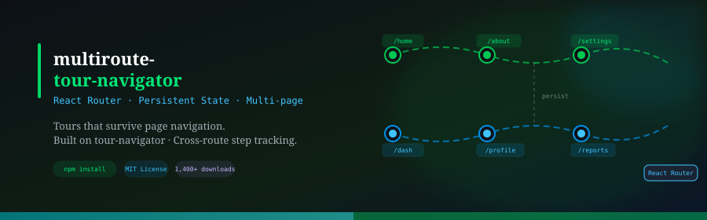

<div align="center">
  
</div>

<br/>

<div align="center">

[](https://www.npmjs.com/package/multiroute-tour-navigator)
[](https://www.npmjs.com/package/multiroute-tour-navigator)
[](LICENSE)
[](https://www.npmjs.com/package/tour-navigator)

**Multi-page guided tours for React apps using React Router.**  
Tours that survive page navigation · Persistent step state · Built on `tour-navigator`.

</div>

---

## About

`multiroute-tour-navigator` extends [`tour-navigator`](https://www.npmjs.com/package/tour-navigator) to support tours that span **multiple routes** in a React Router application. Out of the box, `tour-navigator` is scoped to a single page — when the user navigates away, tour state is lost. This package solves that by threading tour state through React Router's navigation, so a tour can seamlessly continue across `/home`, `/about`, `/settings`, or any sequence of routes you define.

Each page in the tour renders a `<MultiRouteTour>` component. When steps on the current route are complete, the component automatically navigates to the next route, passing the accumulated tour state along so the next page picks up exactly where the previous one left off.

---

## Installation

```bash
npm install tour-navigator multiroute-tour-navigator
# or
yarn add tour-navigator multiroute-tour-navigator
```

> `tour-navigator` is a required peer dependency. Both packages must be installed.

---

## How It Works

1. Each route in your tour renders a `<MultiRouteTour>` with its own `steps` array.
2. You pass `number` to identify the route's position in the tour sequence (1, 2, 3…).
3. When all steps on the current route finish, `onNavigate` is called — you navigate to `nextStepRoute` and pass the tour `state` along.
4. On the next route, you read `state` from `location.state.tour` and pass it back in as the `state` prop — the tour resumes from the correct step.

---

## Quick Start

### Route 1 — `/home`

```tsx
import { MultiRouteTour } from 'multiroute-tour-navigator';
import { useLocation, useNavigate } from 'react-router-dom';

const HomePage = () => {
  const location = useLocation();
  const navigate = useNavigate();

  return (
    <>
      <YourPageContent />
      <MultiRouteTour
        id="onboarding-tour"
        steps={homeSteps}
        state={location?.state?.tour}   // undefined on the first page — that's fine
        number={1}
        nextStepRoute="/about"
        nextStepCount={aboutSteps.length}
        onNavigate={(route, state) =>
          navigate(route, { state: { tour: state }, replace: true })
        }
      />
    </>
  );
};
```

### Route 2 — `/about`

```tsx
const AboutPage = () => {
  const location = useLocation();
  const navigate = useNavigate();

  return (
    <>
      <YourPageContent />
      <MultiRouteTour
        id="onboarding-tour"
        steps={aboutSteps}
        state={location?.state?.tour}   // picks up state from the previous route
        number={2}
        nextStepRoute="/settings"
        nextStepCount={settingsSteps.length}
        onNavigate={(route, state) =>
          navigate(route, { state: { tour: state }, replace: true })
        }
      />
    </>
  );
};
```

### Route 3 — `/settings` (last route)

```tsx
const SettingsPage = () => {
  const location = useLocation();

  return (
    <>
      <YourPageContent />
      <MultiRouteTour
        id="onboarding-tour"
        steps={settingsSteps}
        state={location?.state?.tour}
        number={3}
        // No nextStepRoute — this is the final route
      />
    </>
  );
};
```

---

## Props

`MultiRouteTour` accepts all props from `TourNavigatorProps` (see [`tour-navigator`](https://www.npmjs.com/package/tour-navigator)), plus the following:

| Prop | Type | Required | Default | Description |
|------|------|----------|---------|-------------|
| `id` | `string` | ✅ | — | Unique identifier for the tour instance. Must be the same across all routes. |
| `steps` | `Step[]` | ✅ | — | Array of tour steps for this route. |
| `state` | `array` | — | — | Tour state passed from the previous route via `location.state.tour`. Leave undefined on the first route. |
| `number` | `number` | — | auto | Position of this route in the tour sequence (1-based). Auto-increments if omitted. |
| `nextStepRoute` | `string` | — | — | Path to navigate to after all steps on this route are complete. Omit on the final route. |
| `nextStepCount` | `number` | — | — | Total number of steps on the next route. Required when `nextStepRoute` is set. |
| `onNavigate` | `(route: string, state: any) => void` | — | — | Called when the tour is ready to move to the next route. Use this to call `navigate()` and pass `state` along. |
| `replace` | `boolean` | — | `false` | Whether to replace the current history entry when navigating to the next route. |
| `ref` | `Ref<MultiRouteTourRefProps>` | — | — | Ref for imperative control (see below). |

---

## Ref API

Attach a `ref` to `<MultiRouteTour>` for imperative control over the tour:

```tsx
import { useRef } from 'react';
import type { MultiRouteTourRefProps } from 'multiroute-tour-navigator';

const tourRef = useRef<MultiRouteTourRefProps>(null);

// Imperatively advance the tour
tourRef.current?.next();

<MultiRouteTour ref={tourRef} ... />
```

### `MultiRouteTourRefProps`

```typescript
interface MultiRouteTourRefProps {
  id: string;
  currentStep: Step | null;
  currentStepIndex: number;
  previousStepIndex: number;
  steps: Step[] | null;
  target: HTMLElement | null;
  isScrollingIntoView: boolean;

  focus: (scrollBehavior?: 'auto' | 'smooth') => void;
  goto: (stepIndex: number) => void;
  next: () => void;
  prev: () => void;
  onRequestClose: (params: {
    event: MouseEvent | PointerEvent;
    isMask: boolean;
    isOverlay: boolean;
  }) => void;
}
```

---

## Important Notes

**Pass `state` on every route, including the first.** On the first route `location.state?.tour` will be `undefined` — that's expected and handled internally. Don't skip the prop.

**Use `replace: true` in `navigate()`.** This prevents the user from hitting the browser back button mid-tour and landing on a broken state.

**`id` must match across all routes.** The same string ties the distributed tour instance together.

**`nextStepCount` must be accurate.** This is how the component knows the total step count for progress indicators across route boundaries.

---

## License

MIT © [Vivek Sharma](https://github.com/viveKing21)
